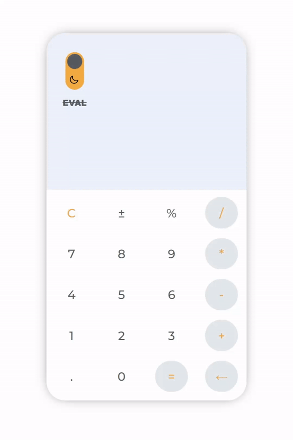
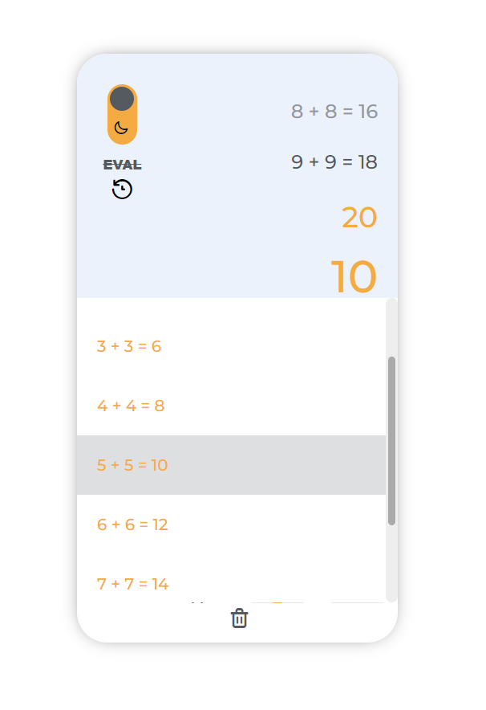

`#HTML` `#CSS` `#JavaScript` `#assembler-institute-of-technology`

[](#contributors-)

# Vanilla JavaScript Calculator <!-- omit in toc -->

This is a demo app that helped us learn the fundamentals of JavaScript by creating together a HTML, CSS, and JS calculator made with and without EVAL.
In this project we develop a calculator with two graphical styles: Light Mode & Dark Mode.

## Table of Contents <!-- omit in toc -->

- [Getting Started](#getting-started)
- [The Project](#the-project)

### Getting Started

First, you will need to clone the repo:

```bash
$ git clone https://github.com/joejoyjoy/assembler-projects.git
```


## The Project

Coding a real project is the best way to learn JavaScript, and a calculator is one of the best projects to start with. A calculator covers all the complex interactions with UI and JavaScript and is simple enough for any particular level you may have.


<b>⬆️Calculator UI/UX⬆️</b>



<b>⬆️Calculator switch Light Mode & Dark Mode.⬆️</b>



<b>⬆️Calculator history mode⬆️</b> You can select and continue calculation. Also able to delete history.

## Contributors ✨

Thanks go to these wonderful people ([emoji key](https://allcontributors.org/docs/en/emoji-key)):

<!-- ALL-CONTRIBUTORS-LIST:START - Do not remove or modify this section -->
<!-- prettier-ignore-start -->
<!-- markdownlint-disable -->
<table>
  <tbody>
    <tr>
        <td align="center">
            <a href="https://github.com/DTPF">
                
                <br />
                <sub>
                <b>David T. Pizarro Frick</b>
                </sub>
            </a>
            <br />
            <a href="#tools-dtpf" title="code-tools-maintenance-design">💻🔧🚧🎨</a>
        </td>
        <td align="center">
            <a href="https://github.com/devs-toni">
                
                <br />
                <sub>
                <b>Antonio Rufino Casasus</b>
                </sub>
            </a>
            <br />
            <a href="#code-devstoni" title="code-tools-maintenance-design">💻🔧🚧🎨</a>
        </td>
        <td align="center">
            <a href="https://github.com/joejoyjoy">
                
                <br />
                <sub>
                <b>Joe Alt</b>
                </sub>
            </a>
            <br />
            <a href="#tools-dtpf" title="code-tools-maintenance-design">💻🔧🚧🎨</a>
        </td>
        <td align="center">
            <a href="https://github.com/pablohgb">
                
                <br />
                <sub>
                <b>Pablo Herrero</b>
                </sub>
            </a>
            <br />
            <a href="#code-pablohgb" title="code-tools-maintenance-design">💻🔧🚧🎨</a>
        </td>
    </tr>
  </tbody>
</table>

This project follows the [all-contributors](https://allcontributors.org) specification.
Contributions of any kind are welcome!

## License <!-- omit in toc -->

This project is licensed under the MIT License