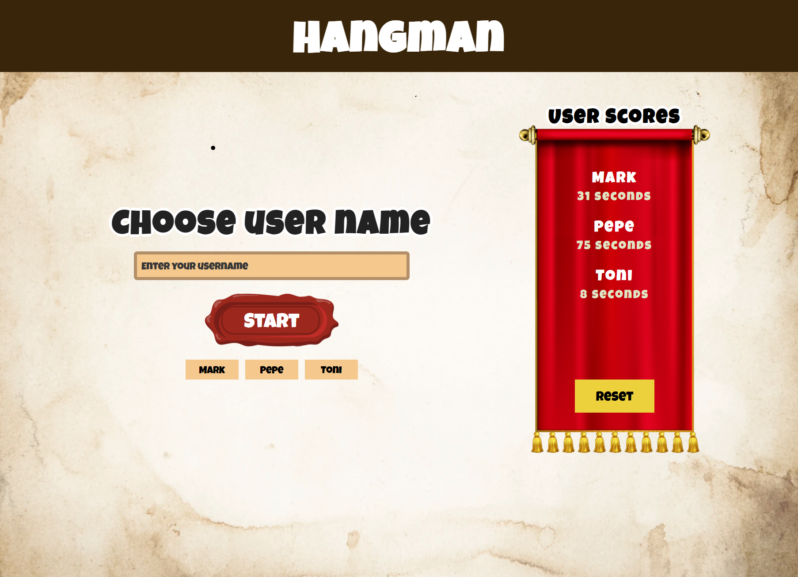
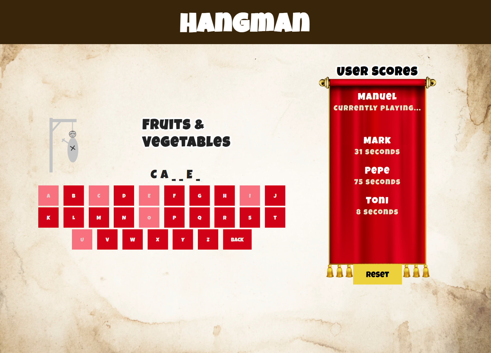

`#HTML` `#CSS` `#JavaScript` `#assembler-institute-of-technology`

[](#contributors-)

# Hangman - Play with Assembler <!-- omit in toc -->

In this game you will play Hangman in which you will have to discover the hidden word by choosing letters.
You will have to guess a word by clicking the letter boxes on the screen before the hangman is drawn on the screen.

## Table of Contents <!-- omit in toc -->

- [Getting Started](#getting-started)
- [The Project](#the-project)

### Getting Started

First, you will need to clone the repo:

```bash
$ git clone https://github.com/joejoyjoy/assembler-projects.git
```


## The Project

Coding a real project is the best way to learn. This was a funny project to do as a team and helped each one to become better at where we good at💪.



<b>⬆️Game home screen. See user scores and user name input⬆️</b>



<b>⬆️Play the game!⬆️</b>


<b>⬆️Well done!⬆️</b> Here is the final part. You will be positioned correctly by time.

## Contributors ✨

Thanks go to these wonderful people ([emoji key](https://allcontributors.org/docs/en/emoji-key)):

<!-- ALL-CONTRIBUTORS-LIST:START - Do not remove or modify this section -->
<!-- prettier-ignore-start -->
<!-- markdownlint-disable -->
<table>
  <tbody>
    <tr>
        <td align="center">
            <a href="https://github.com/DTPF">
                
                <br />
                <sub>
                <b>David T. Pizarro Frick</b>
                </sub>
            </a>
            <br />
            <a href="#tools-dtpf" title="code-tools-maintenance-design">💻🔧🚧🎨</a>
        </td>
        <td align="center">
            <a href="https://github.com/devs-toni">
                
                <br />
                <sub>
                <b>Antonio Rufino Casasus</b>
                </sub>
            </a>
            <br />
            <a href="#code-devstoni" title="code-tools-maintenance-design">💻🔧🚧🎨</a>
        </td>
        <td align="center">
            <a href="https://github.com/joejoyjoy">
                
                <br />
                <sub>
                <b>Joe Alt</b>
                </sub>
            </a>
            <br />
            <a href="#tools-dtpf" title="code-tools-maintenance-design">💻🔧🚧🎨</a>
        </td>
        <td align="center">
            <a href="https://github.com/pablohgb">
                
                <br />
                <sub>
                <b>Pablo Herrero</b>
                </sub>
            </a>
            <br />
            <a href="#code-pablohgb" title="code-tools-maintenance-design">💻🔧🚧🎨</a>
        </td>
    </tr>
  </tbody>
</table>

This project follows the [all-contributors](https://allcontributors.org) specification.
Contributions of any kind are welcome!

## License <!-- omit in toc -->

This project is licensed under the MIT License