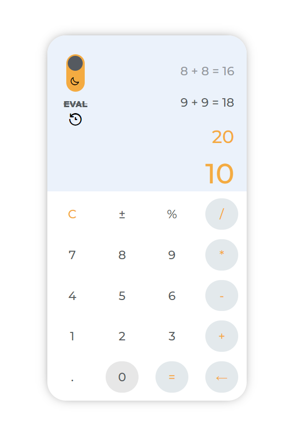
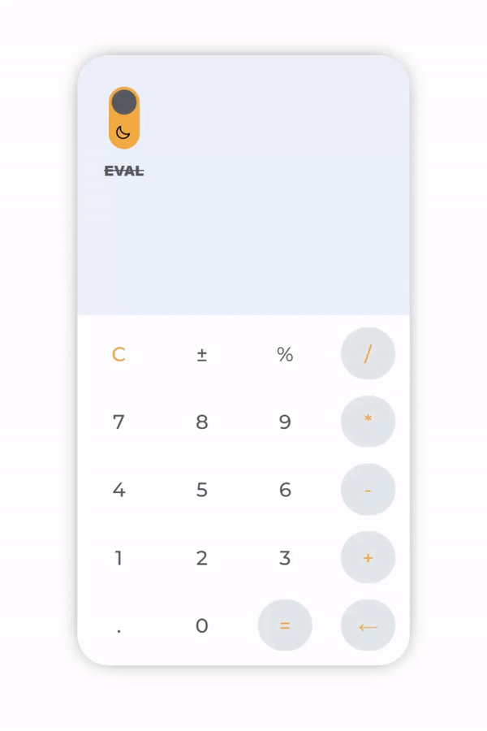

`#master-in-software-engineering` `#assembler-institute-of-technology`

[](#contributors-)

## Table of Projects
* [Calculator](#calculator) <span style="color:grey">· 14 November 2022</span>
* [Shopping Wizzard](#shopping-wizzard) <span style="color:grey">· 22 November 2022</span>
* [Play with Assembler](#play-with-assembler) <span style="color:grey">· 1 December 2022</span>
* [Blog with API](#blog-with-api) <span style="color:grey">· 12 December 2022</span>

## General info
This repo contains all experimental projects made to help as a team become better developers.
It was a fun and helpful way to learn the fundamental parts of web development, we hope you can have as much fun as we had well creating the projects by taking a look one by one.
	
## Technologies
This projects are mostly created by:
* HTML
* CSS
* Vanilla JavaScript

### Getting Started

First, you will need to clone the repo:

```bash
$ git clone https://github.com/joejoyjoy/assembler-projects.git
```

## Calculator
This is a demo app that helped us learn the fundamentals of JavaScript by creating together a HTML, CSS, and JS calculator made with and without EVAL.
In this project we develop a calculator with two graphical styles: Light Mode & Dark Mode. [See full project demo & sours code](Calculator)
<p float="left">
  
  
</p>

## Shopping Wizzard
This shopping wizzard user friendly interface is make to simulate a shopping experience from choosing the size and color to make the purchase(on bank cards involved). 
Our project theme is carried away into selling electric kick scooters. To make it more fun we have added a timer during the purchase, if it exceeds you will be redirect to the main page. [See full project demo & source code](Shopping_Wizzard)


## Play with Assembler
In this game you will play Hangman in which you will have to discover the hidden word by choosing letters.
You will have to guess a word by clicking the letter boxes on the screen before the hangman is drawn on the screen. [See full project demo & source code](Play_With_Assembler)

<p float="left">
 

</p>

## Blog with API
Created a Blog from JSONplaceholder server using Twitter designed framework Bootstrap.
[See full project demo & source code](blog_with_API)


## Contributors ✨

Thanks go to these wonderful people ([emoji key](https://allcontributors.org/docs/en/emoji-key)):

<!-- ALL-CONTRIBUTORS-LIST:START - Do not remove or modify this section -->
<!-- prettier-ignore-start -->
<!-- markdownlint-disable -->
<table>
  <tbody>
    <tr>
        <td align="center">
            <a href="https://github.com/DTPF">
                
                <br />
                <sub>
                <b>David T. Pizarro Frick</b>
                </sub>
            </a>
            <br />
            <a href="#tools-dtpf" title="code-tools-maintenance-design">💻🔧🚧🎨</a>
        </td>
        <td align="center">
            <a href="https://github.com/devs-toni">
                
                <br />
                <sub>
                <b>Antonio Rufino Casasus</b>
                </sub>
            </a>
            <br />
            <a href="#code-devstoni" title="code-tools-maintenance-design">💻🔧🚧🎨</a>
        </td>
        <td align="center">
            <a href="https://github.com/joejoyjoy">
                
                <br />
                <sub>
                <b>Joe Alt</b>
                </sub>
            </a>
            <br />
            <a href="#tools-dtpf" title="code-tools-maintenance-design">💻🔧🚧🎨</a>
        </td>
        <td align="center">
            <a href="https://github.com/pablohgb">
                
                <br />
                <sub>
                <b>Pablo Herrero</b>
                </sub>
            </a>
            <br />
            <a href="#code-pablohgb" title="code-tools-maintenance-design">💻🔧🚧🎨</a>
        </td>
    </tr>
  </tbody>
</table>

This project follows the [all-contributors](https://allcontributors.org) specification.
Contributions of any kind are welcome!

## License <!-- omit in toc -->

This project is licensed under the MIT License