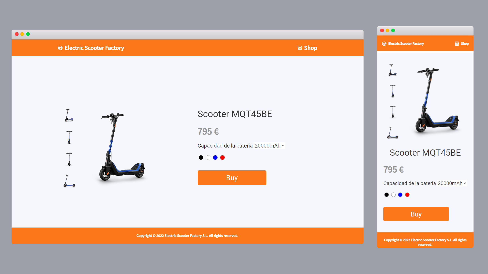
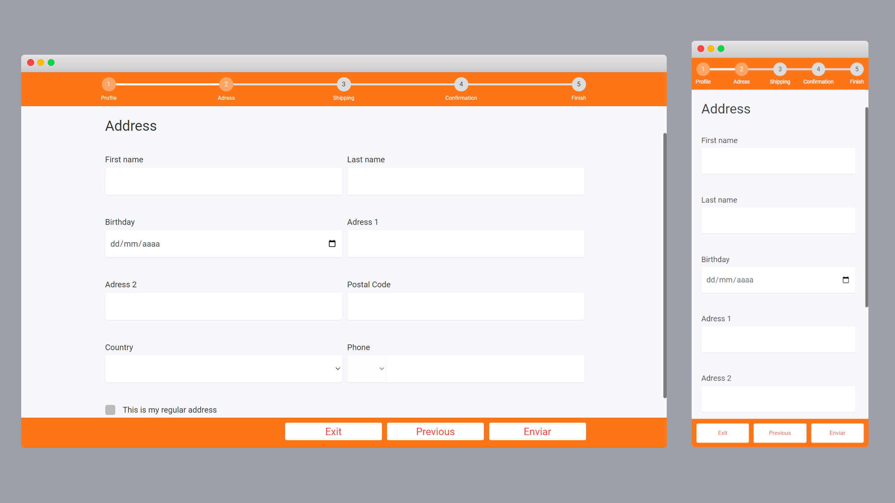

`#HTML` `#CSS` `#JavaScript` `#assembler-institute-of-technology`

[](#contributors-)

# Shopping wizzard <!-- omit in toc -->

In this project we developed a shopping process form with several steps, where each step will have its own validation. All of this in one HTML page and the content change dynamically.
This Shopping process is an HTML form with custom CSS styles and JS validation. This project has helped us as a team:
* To improve our knowledge of JavaScript
* Learn to work with the HTML DOM.
* Learn and improve our knowledge in logic processes
* Learn to validate forms using Javascript.

## Table of Contents <!-- omit in toc -->

- [Getting Started](#getting-started)
- [The Project](#the-project)

### Getting Started

First, you will need to clone the repo:

```bash
$ git clone https://github.com/joejoyjoy/assembler-projects.git
```

## The Project

This shopping wizzard user friendly interface is make to simulate a shopping experience from choosing the size and color to make the purchase(on bank cards involved). 
Our project theme is carried away into selling electric kick scooters. To make it more fun we have added a timer during the purchase, if it exceeds you will be redirect to the main page.

1. You will friendly be welcomed into the main page where you can select your perfect fit.
2. After so you will be greet into a SignUp form page where the password need to be the same.
	1. Password must be at least 8 characters, minimum of 1 lower case letter [a-z], minimum of 1 upper case letter [A-Z], minimum of 1 numeric character [0-9] and a minimum of 1 special character: ~`!@#$%^&*()-_+={}[]|\;:"<>,./?
3. After so the address where the electric kick scooter will be delivered will be asked.
4. The shipping page will be shown so you can choose what you want as delivery. How faster the delivery how more expensive it gets. You can also add a gift card for free! 
5. The hole experience comes down to this moment... The validation and final button to confirm the purchase.



<b>⬆️Landing page⬆️</b> You can select battery capacity and your favorite color of scooter.



<b>⬆️Address page⬆️</b> You can fill out your personal details. 
You can also navigate to previous page if needed.


<b>⬆️Shipping page⬆️</b> You can select your preferred option of shipment. You can also add a gift letter with a image.


<b>⬆️Success page⬆️</b> Congratulations! You will receive your customized scooter soon.

## Contributors ✨

Thanks go to these wonderful people ([emoji key](https://allcontributors.org/docs/en/emoji-key)):

<!-- ALL-CONTRIBUTORS-LIST:START - Do not remove or modify this section -->
<!-- prettier-ignore-start -->
<!-- markdownlint-disable -->
<table>
  <tbody>
    <tr>
        <td align="center">
            <a href="https://github.com/DTPF">
                
                <br />
                <sub>
                <b>David T. Pizarro Frick</b>
                </sub>
            </a>
            <br />
            <a href="#tools-dtpf" title="code-tools-maintenance-design">💻🔧🚧🎨</a>
        </td>
        <td align="center">
            <a href="https://github.com/devs-toni">
                
                <br />
                <sub>
                <b>Antonio Rufino Casasus</b>
                </sub>
            </a>
            <br />
            <a href="#code-devstoni" title="code-tools-maintenance-design">💻🔧🚧🎨</a>
        </td>
        <td align="center">
            <a href="https://github.com/joejoyjoy">
                
                <br />
                <sub>
                <b>Joe Alt</b>
                </sub>
            </a>
            <br />
            <a href="#tools-dtpf" title="code-tools-maintenance-design">💻🔧🚧🎨</a>
        </td>
        <td align="center">
            <a href="https://github.com/pablohgb">
                
                <br />
                <sub>
                <b>Pablo Herrero</b>
                </sub>
            </a>
            <br />
            <a href="#code-pablohgb" title="code-tools-maintenance-design">💻🔧🚧🎨</a>
        </td>
    </tr>
  </tbody>
</table>

This project follows the [all-contributors](https://allcontributors.org) specification.
Contributions of any kind are welcome!

## License <!-- omit in toc -->

This project is licensed under the MIT License