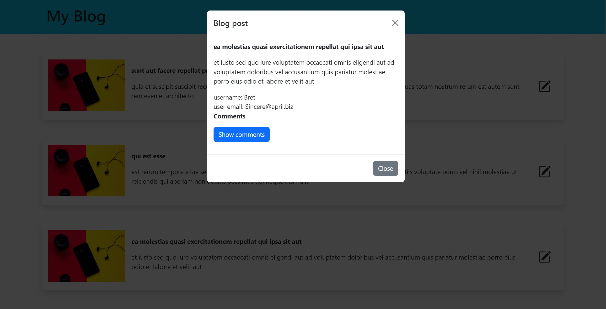

# Blog with API - Assembler Institute of Technology - MSD OCT22

Project created by [Joe Alt](https://github.com/joejoyjoy) & [Pablo](https://github.com/pablohgb)

## Install

```bash
git clone
cd blog_with_API
npm install
```

## Run local database

```bash
cd blog_with_API
json-server --watch db.json
```

## Preview of Project



## Credits

Database is powerd by jsonplaceholder.typicode.com
[jsonplaceholder.typicode.com]: <https://jsonplaceholder.typicode.com/>